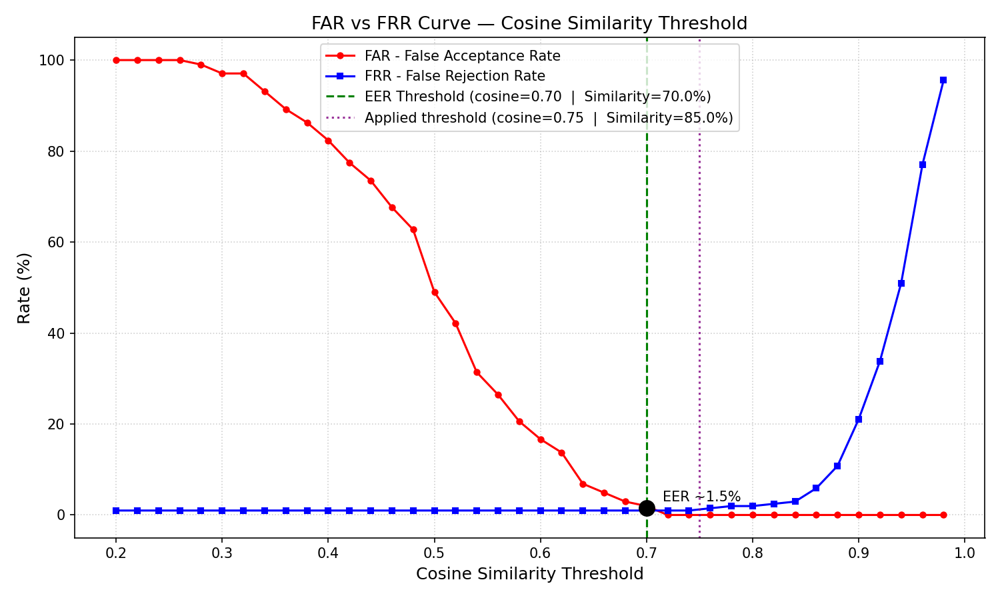
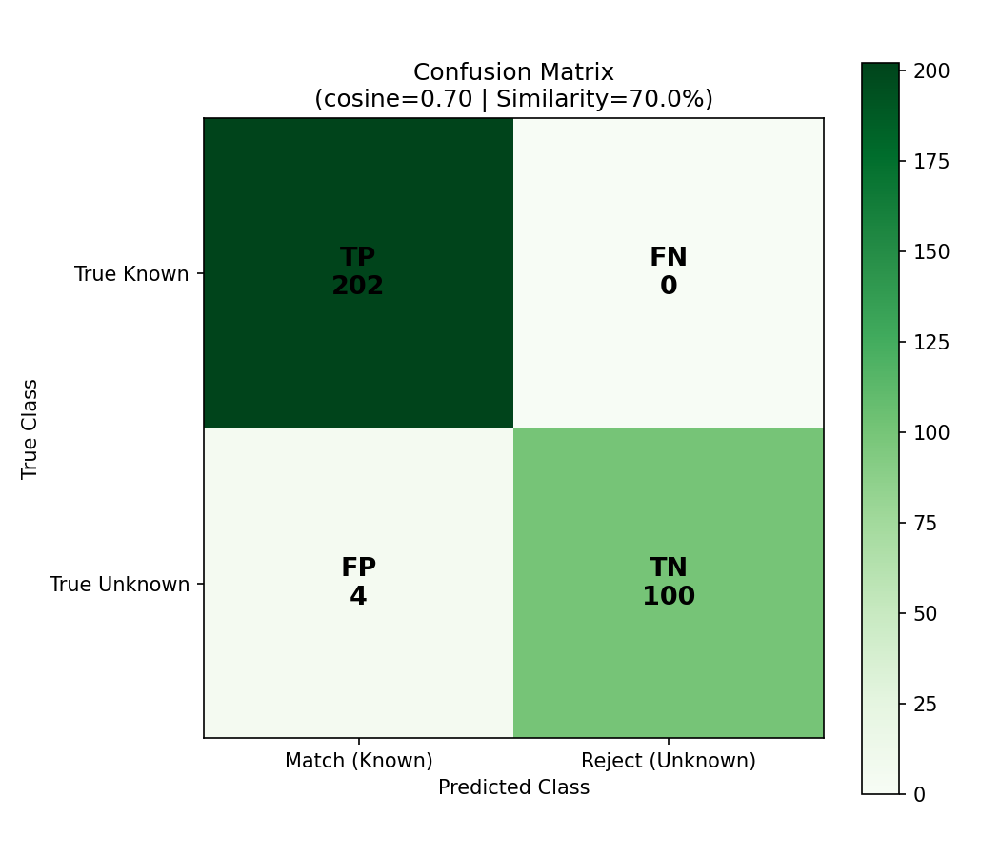

# Bao cao danh gia nguong quyet dinh he thong CCTV nhan dien khuon mat

## Pipeline su dung
**YOLOv8-Face (ONNX)** -> **MediaPipe Selfie Segmenter** -> **FaceNet InceptionResnetV1** (VGGFace2)

Tuc la pipeline day du, giong het voi luong /identify API dang chay trong san pham thuc te.

---

## Bo du lieu kiem thu: `faces94`
* **Nguon:** Essex University Faces94 Dataset (anh chan dung trong nha, 153 doi tuong)
* **Doi tuong da dang ky (Known):** 102 nguoi (moi nguoi dang ky 1 anh mau)
* **Truy van hop le (Genuine queries):** 204 anh (anh thu 2 va 3 cua nguoi da dang ky)
* **Truy van gia mao (Impostor queries):** 102 anh (51 nguoi la x 2 anh)

---

## Ket qua tai nguong EER toi uu

| Chi so | Gia tri |
|:---|:---:|
| **Nguong Cosine Similarity toi uu (EER)** | `0.70` |
| **Nguong Similarity% tuong duong (hien thi UI)** | `70.0%` |
| **Equal Error Rate (EER)** | **1.47%** |
| **Accuracy** | 98.69% |
| **Precision** | 98.06% |
| **Recall** | 100.00% |
| **F1-Score** | 99.02% |

---

## Ma tran nham lan (Confusion Matrix)

| | Du doan la Cung nguoi (Match) | Du doan la Nguoi la (Reject) |
|:---|:---:|:---:|
| **Thuc te la Nguoi da dang ky** | **TP = 202** | FN = 0 |
| **Thuc te la Nguoi la** | FP = 4 | **TN = 100** |

* **True Positive (TP):** 202 - nguoi da dang ky duoc nhan dien dung danh tinh
* **False Negative (FN):** 0 - nguoi da dang ky bi tu choi hoac nhan nham sang nguoi khac
* **False Positive (FP):** 4 - nguoi la bi nhan nham la nguoi da dang ky
* **True Negative (TN):** 100 - nguoi la bi tu choi dung

---

## So sanh nguong

| Nguong | Cosine Similarity | Similarity% (UI) | FAR | FRR |
|:---|:---:|:---:|:---:|:---:|
| Ma nguon cu (truoc khi sua) | 0.55 | 65.0% | 31.37% | 0.98% |
| Nguong EER toi uu | 0.70 | 70.0% | 1.96% | 0.98% |
| **Nguong dang ap dung (85%)** | **0.75** | **85.0%** | **0.00%** | **0.98%** |

---

## Bieu do FAR vs FRR

---

## Bang so lieu chi tiet FAR / FRR theo tung nguong Cosine

| Cosine Similarity | Similarity% (UI) | FAR (%) | FRR (%) |
|:---:|:---:|:---:|:---:|
| 0.20 | 20.0% | 100.00% | 0.98% |
| 0.22 | 22.0% | 100.00% | 0.98% |
| 0.24 | 24.0% | 100.00% | 0.98% |
| 0.26 | 26.0% | 100.00% | 0.98% |
| 0.28 | 28.0% | 99.02% | 0.98% |
| 0.30 | 30.0% | 97.06% | 0.98% |
| 0.32 | 32.0% | 97.06% | 0.98% |
| 0.34 | 34.0% | 93.14% | 0.98% |
| 0.36 | 36.0% | 89.22% | 0.98% |
| 0.38 | 38.0% | 86.27% | 0.98% |
| 0.40 | 40.0% | 82.35% | 0.98% |
| 0.42 | 42.0% | 77.45% | 0.98% |
| 0.44 | 44.0% | 73.53% | 0.98% |
| 0.46 | 46.0% | 67.65% | 0.98% |
| 0.48 | 48.0% | 62.75% | 0.98% |
| 0.50 | 50.0% | 49.02% | 0.98% |
| 0.52 | 52.0% | 42.16% | 0.98% |
| 0.54 | 54.0% | 31.37% | 0.98% |
| 0.56 | 56.0% | 26.47% | 0.98% |
| 0.58 | 58.0% | 20.59% | 0.98% |
| 0.60 | 60.0% | 16.67% | 0.98% |
| 0.62 | 62.0% | 13.73% | 0.98% |
| 0.64 | 64.0% | 6.86% | 0.98% |
| 0.66 | 66.0% | 4.90% | 0.98% |
| 0.68 | 68.0% | 2.94% | 0.98% |
| 0.70 | 70.0% | 1.96% | 0.98% |
| 0.72 | 72.0% | 0.00% | 0.98% |
| 0.74 | 74.0% | 0.00% | 0.98% |
| 0.76 | 76.0% | 0.00% | 1.47% |
| 0.78 | 78.0% | 0.00% | 1.96% |
| 0.80 | 80.0% | 0.00% | 1.96% |
| 0.82 | 82.0% | 0.00% | 2.45% |
| 0.84 | 84.0% | 0.00% | 2.94% |
| 0.86 | 86.0% | 0.00% | 5.88% |
| 0.88 | 88.0% | 0.00% | 10.78% |
| 0.90 | 90.0% | 0.00% | 21.08% |
| 0.92 | 92.0% | 0.00% | 33.82% |
| 0.94 | 94.0% | 0.00% | 50.98% |
| 0.96 | 96.0% | 0.00% | 76.96% |
| 0.98 | 98.0% | 0.00% | 95.59% |
